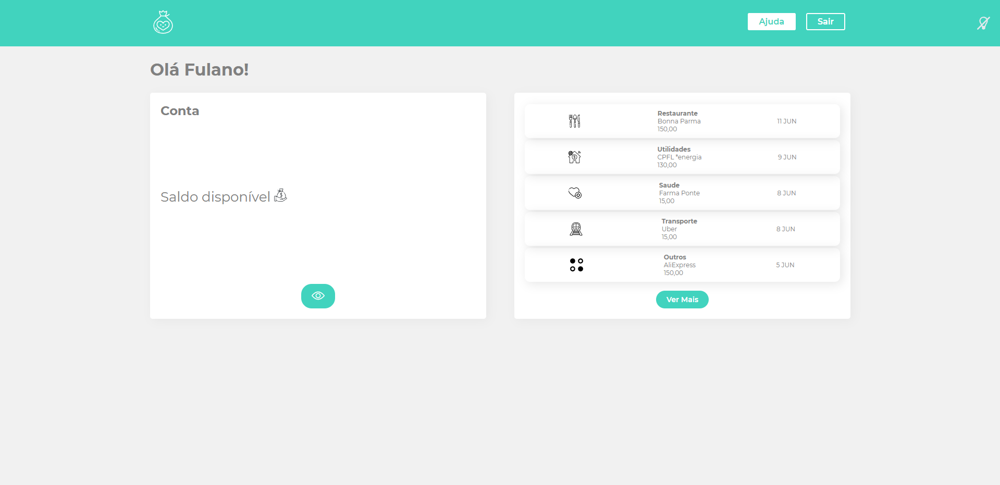
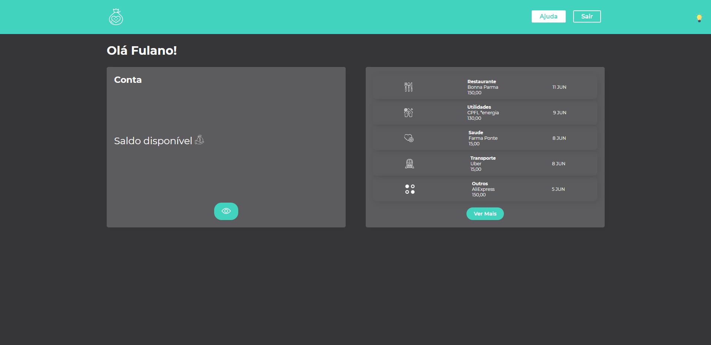

<h1> AppBank </h1>
</br>
    <h2>Desenvolvido em : </h2>
    


</br>
    <p>📌 Projeto relizado seguindo o curso da Alura</p>
</br>
<hr>
    </br>
    
    </br>
    </br>
         
</br>
</br>
<p aling="center"> 🖥️ Projeto criado com a intenção de representar um aplicativo bancário com as funções de saldo e extrato bancário. A plataforma também ermite alterar entre modo light e modo dark.</p>

</br>

### 🎲 Rodando o Front 

```bash

    # Clone este repositório  
    $ git clone <https://github.com/KayoSilva19/projeto-Styled-Components-ReactJS>

    # Acesse a pasta do projeto no terminal/cmd
    $ cd projeto-Styled-Components-ReactJS

    # Instalando Dependências
    $ npm install

    # Rodando o Projeto
    $ npm start

```
